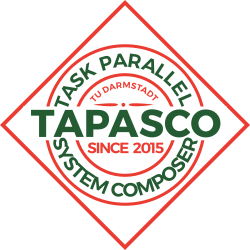

The Task Parallel System Composer (TaPaSCo)
===========================================


Master Branch Status: [](https://git.esa.informatik.tu-darmstadt.de/tapasco/tapasco/commits/master)
Dev Branch Status: [](https://git.esa.informatik.tu-darmstadt.de/tapasco/tapasco/commits/develop)

System Requirements
-------------------
TaPaSCo is known to work in this environment:

*   Intel x86_64 arch
*   Linux kernel 4.4+
*   Fedora 26+, Ubuntu 16.04+
*   Fedora 24/25 does not support debug mode due to GCC bug
*   Bash Shell 4.2.x+

Other setups likely work as well, but are untested.

Prerequisites
-------------
To use TaPaSCo, you'll need working installations of

*   Vivado Design Suite 2017.4 or newer
*   Java SDK 8 - 11
*   git
*   python
*   GCC newer than 5.x.x for C++11 support
*   *OPTIONAL:* libncurses for the tapasco-debug application
*   *OPTIONAL:* Local Installation of gradle 5.0+, if you do not want to use the included wrapper.

If you want to use the High-Level Synthesis flow for generating custom IP
cores, you will also need:

*   Vivado HLS 2017.4+

Check that at least the following are in your `$PATH`:

*   `vivado`
*   `git`
*   `bash`
*   \[`vivado_hls`\] - Since Vivado 2018.1 this is included in `vivado`

Basic Setup
-------------------
1.	Create or open a folder, which you would like to use as your TaPaSCo workspace.
	Within this folder, source the TaPaSCo-Initialization-Script which is located in
	`path/to/tapasco/tapasco-init.sh`. This will setup your current folder as `TAPASCO_WORK_DIR`.
	It will also create the file `tapasco-setup.sh` within your workdir.
2.	Source `tapasco-setup.sh`.
3.  Build TaPaSCo: 
    ```bash
    cd path/to/tapasco
    cd toolflow/scala
    ./gradlew installDist
    ```
3.  _Optional_: Run TaPaSCo unit tests from `path/to/tapasco/toolflow/scala`: `gradle check`
4.  _Optional_: Generate sample configuration file: `tapasco -n config.json`
    TaPaSCo should exit immediately and `config.json` will include a full
    configuration that can be read with `--configFile`, including one example
    for each kind of job.
5.  Build libraries and _tlkm_ kernel module: `tapasco-build-libs`

When everything completed successfully, **TaPaSCo is ready to use!**

Whenever you want to use TaPaSCo in the future, just source the corresponding workspace using the `tapasco-setup.sh`.
This also allows you to have multiple independent TaPaSCo-Workspaces.

Build a TaPaSCo design
----------------------
1.  Import your kernels
    *   HDL flow: `tapasco import path/to/ZIP as <ID> -p <PLATFORM>`
    *   HLS flow: `tapasco --kernelDir path/to/kernels hls <KERNELS> -p <PLATFORM>`
2.  Create a composition: `tapasco compose [<KERNEL> x <COUNT>] @ <NUM> MHz -p <PLATFORM>`
3.  Load the bitstream: `tapasco-load-bitstream <BITSTREAM>`
4.  Implement your host software
    *   C API
    *   C++ API

You can get more information about commands with `tapasco --help` and the corresponding subpages with `tapasco --help <TOPIC>`

Acknowledgements
----------------
TaPaSCo is based on [ThreadPoolComposer][1], which was developed by us as part
of the [REPARA project][2], a _Framework Seven (FP7) funded project by the
European Union_.

We would also like to thank [Bluespec, Inc.][3] for making their _Bluespec
SystemVerilog (BSV)_ tools available to us and their permission to distribute
the Verilog code generated by the _Bluespec Compiler (bsc)_.

[1]: https://git.esa.informatik.tu-darmstadt.de/REPARA/threadpoolcomposer.git
[2]: http://repara-project.eu/
[3]: http://bluespec.com/

Publications
------------

A List of publications about TaPaSCo or TaPaSCo-related research can be found [here](https://github.com/esa-tu-darmstadt/tapasco/wiki/Publications).

If you want to cite TaPaSCo, please use the following information:

[Korinth2019] Korinth, Jens, Jaco Hofmann, Carsten Heinz, and Andreas Koch. 2019. **The
Tapasco Open-Source Toolflow for the Automated Composition of Task-Based
Parallel Reconfigurable Computing Systems.** In *International Symposium
on Applied Reconfigurable Computing (Arc)*.

Releases
----------------

We provided pre-compiled packages for many popular Linux distributions. All packages are build for the x86_64 variant.

### Ubuntu 16.04
[Kernel Driver](https://git.esa.informatik.tu-darmstadt.de/tapasco/tapasco/-/jobs/artifacts/master/raw/tlkm/tlkm.ko?job=build_kernel_ubuntu_16_04)
[Kernel Driver Debug](https://git.esa.informatik.tu-darmstadt.de/tapasco/tapasco/-/jobs/artifacts/master/raw/tlkm/tlkm.ko?job=build_kernel_ubuntu_16_04_debug)
[Runtime (DEB)](https://git.esa.informatik.tu-darmstadt.de/tapasco/tapasco/-/jobs/artifacts/master/raw/build/tapasco-2019.6.0-Linux.deb?job=build_tapasco_ubuntu_16_04)
[Runtime Debug (DEB)](https://git.esa.informatik.tu-darmstadt.de/tapasco/tapasco/-/jobs/artifacts/master/raw/build/tapasco-2019.6.0-Linux.deb?job=build_tapasco_ubuntu_16_04_debug)

### Ubuntu 18.04
[Kernel Driver](https://git.esa.informatik.tu-darmstadt.de/tapasco/tapasco/-/jobs/artifacts/master/raw/tlkm/tlkm.ko?job=build_kernel_ubuntu_18_04)
[Kernel Driver Debug](https://git.esa.informatik.tu-darmstadt.de/tapasco/tapasco/-/jobs/artifacts/master/raw/tlkm/tlkm.ko?job=build_kernel_ubuntu_18_04_debug)
[Runtime (DEB)](https://git.esa.informatik.tu-darmstadt.de/tapasco/tapasco/-/jobs/artifacts/master/raw/build/tapasco-2019.6.0-Linux.deb?job=build_tapasco_ubuntu_18_04)
[Runtime Debug (DEB)](https://git.esa.informatik.tu-darmstadt.de/tapasco/tapasco/-/jobs/artifacts/master/raw/build/tapasco-2019.6.0-Linux.deb?job=build_tapasco_ubuntu_18_04_debug)

### Fedora 27
[Kernel Driver](https://git.esa.informatik.tu-darmstadt.de/tapasco/tapasco/-/jobs/artifacts/master/raw/tlkm/tlkm.ko?job=build_kernel_fedora_27)
[Kernel Driver Debug](https://git.esa.informatik.tu-darmstadt.de/tapasco/tapasco/-/jobs/artifacts/master/raw/tlkm/tlkm.ko?job=build_kernel_fedora_27_debug)
[Runtime (RPM)](https://git.esa.informatik.tu-darmstadt.de/tapasco/tapasco/-/jobs/artifacts/master/raw/build/tapasco-2019.6.0-Linux.rpm?job=build_tapasco_fedora_27)
[Runtime Debug (RPM)](https://git.esa.informatik.tu-darmstadt.de/tapasco/tapasco/-/jobs/artifacts/master/raw/build/tapasco-2019.6.0-Linux.rpm?job=build_tapasco_fedora_27_debug)

### Fedora 28
[Kernel Driver](https://git.esa.informatik.tu-darmstadt.de/tapasco/tapasco/-/jobs/artifacts/master/raw/tlkm/tlkm.ko?job=build_kernel_fedora_28)
[Kernel Driver Debug](https://git.esa.informatik.tu-darmstadt.de/tapasco/tapasco/-/jobs/artifacts/master/raw/tlkm/tlkm.ko?job=build_kernel_fedora_28_debug)
[Runtime (RPM)](https://git.esa.informatik.tu-darmstadt.de/tapasco/tapasco/-/jobs/artifacts/master/raw/build/tapasco-2019.6.0-Linux.rpm?job=build_tapasco_fedora_28)
[Runtime Debug (RPM)](https://git.esa.informatik.tu-darmstadt.de/tapasco/tapasco/-/jobs/artifacts/master/raw/build/tapasco-2019.6.0-Linux.rpm?job=build_tapasco_fedora_28_debug)

### Fedora 29
[Kernel Driver](https://git.esa.informatik.tu-darmstadt.de/tapasco/tapasco/-/jobs/artifacts/master/raw/tlkm/tlkm.ko?job=build_kernel_fedora_29)
[Kernel Driver Debug](https://git.esa.informatik.tu-darmstadt.de/tapasco/tapasco/-/jobs/artifacts/master/raw/tlkm/tlkm.ko?job=build_kernel_fedora_29_debug)
[Runtime (RPM)](https://git.esa.informatik.tu-darmstadt.de/tapasco/tapasco/-/jobs/artifacts/master/raw/build/tapasco-2019.6.0-Linux.rpm?job=build_tapasco_fedora_29)
[Runtime Debug (RPM)](https://git.esa.informatik.tu-darmstadt.de/tapasco/tapasco/-/jobs/artifacts/master/raw/build/tapasco-2019.6.0-Linux.rpm?job=build_tapasco_fedora_29_debug)
